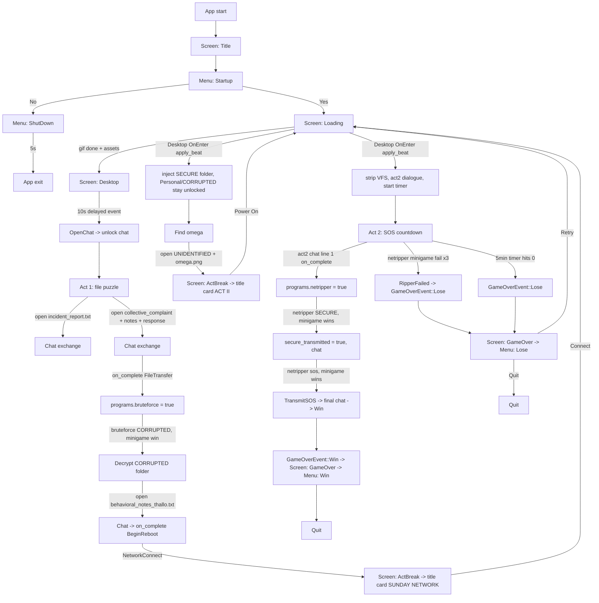

# Game Flow & Narrative-Time Plan

> Goal: make narrative time *addressable* — so "retry after lose", "skip to Act 2",
> and other dev jumps are deterministic instead of pieced together from flags.

---

## 1. Where we are (one paragraph)

The game's narrative position is currently spread across **two Bevy state machines**
(`Screen` and `Menu`) and **three resources** (`UnlockState.story`,
`UnlockState.programs`, and `Dialogues`), plus mutable VFS/timer/window/alert state.
There is no single value that says "I am at beat X". `StoryProgress` is a plain
resource, not a Bevy state, so routing today is done through helper methods on
`UnlockState.story` (`is_act2()` / `is_connecting_sunday()`) rather than by
matching the resource itself. Transitions are triggered by `ScriptedEventTrigger`s
and routed by those boolean helpers. Retry and the F5/F6 dev hotkeys work only by re-using the
`ActBreak -> Title -> Menu -> Loading -> Desktop` ceremony, and they reset only a
*subset* of state, so they are fragile.

---

## 2. Full flow chart (current)



---

## 3. What triggers what (reference)

| Trigger | Emits / result | State written |
|---|---|---|
| 10s after Desktop `OnEnter` | `ScriptedEventTrigger::OpenChat` | `programs.chat = true`, opens chatbox |
| Open `incident_report.txt` (`Any`) | `FileTrigger` | chat lines |
| Open `collective_complaint`+`notes`+`response` (`All`) | `FileTrigger` → `ChatTrigger(FileTransfer(BruteForce))` | `programs.bruteforce = true` after transfer alert |
| `bruteforce [CORRUPTED]` + minigame win | `DecryptComplete` | decrypts folder in VFS |
| Open `behavioral_notes_thallo.txt` (`All`) | `BeginReboot(NetworkConnect)` | `apply_beat(Act1Connecting)`, `Screen::ActBreak` |
| Open `[UNIDENTIFIED]`+`omega.png` (`All`) | `BeginReboot(ActTrans)` | `apply_beat(Act2Sos)`, `Screen::ActBreak` |
| Act 2 chat line 1 (`on_complete`) | `ChatTrigger(FileTransfer(NetRipper))` | `programs.netripper = true` after transfer alert |
| `netripper [SECURE]` + minigame wins | `RipperComplete(TransmitSecure)` | `secure_transmitted = true`, adds chat lines |
| `netripper sos` + minigame wins | `RipperComplete(TransmitSOS)` → `Win` | `GameOverEvent::Win` |
| NetRipper minigame fail ×3 | `RipperFailed` | `GameOverEvent::Lose` |
| Act 2 timer reaches 0 | `effect_game_over` | `GameOverEvent::Lose` |

> **Folders stay unlocked across beats.** `build_fs_for_beat(Act1Connecting)`
> rebuilds the Act 1 desktop with `Personal` already unlocked and `[CORRUPTED]`
> already decrypted (instead of relocking them), and `Act2Sos` rebuilds a desktop
> with `[SECURE]` already decrypted. `Act1Intro` is the only beat where those
> folders start locked.

---

## 4. Root causes of the mess

1. **No single "beat" value.** Narrative position is *derived* from booleans
   (`network_reconnected`, `act`, `secure_transmitted`) via `is_act2()` /
   `is_connecting_sunday()`. You cannot jump to a beat; you can only flip flags.

2. **Two parallel state machines.** `Screen` and `Menu` both encode narrative
   position. Before the act-break merge this routing was duplicated in
   `src/engine/screens/title.rs::open_startup_warning` and a separate
   `open_break_menu` (both branching on `is_act2()` / `is_connecting_sunday()`
   rather than on a `StoryBeat` value).

3. **Transition ceremony is reused for everything.** Every act change goes
   `ActBreak -> Title -> Menu -> Loading -> Desktop`. Retry and dev skips abuse
   this, so they replay title cards ("ACT II", "SUNDAY NETWORK") that aren't the
   right narrative beat. Retry currently relies on `act` staying `true` because
   `effect_game_over` only resets `netripper` and `secure_transmitted`.

4. **Setup is incremental and idempotence is implicit.**
   - `setup_stuffs` runs only once (`not(resource_exists::<FsHierarchy>)`) and
     spawns a `DespawnOnExit(Screen::Desktop)` music entity.
   - `connect_sunday_net` and `setup_act2` mutate the *existing* VFS.
   - `setup_act2` clears `FileDialogueTriggers.triggers` but **not** `opened`
     (the field is private and never cleared).
   This makes "rebuild state for beat X" impossible to call safely.

5. **Reset is partial.** `effect_game_over` resets only `netripper` and
   `secure_transmitted`; it relies on `act` still being `true` to route Retry back
   to Act 2. Transient state (`OpenWindows`, `OpenAlerts`, `ActiveMinigame`, the
   `DialogueRunner`, and the `Pause` state) is not reset in one place.

6. **Multiple sites write flags directly.** `devtools.rs` triggers `BeginReboot`
   and toggles program flags; `effect_open_chat` sets `programs.chat`; and the
   file-transfer popup in `src/ui/popups.rs` unlocks `bruteforce`/`netripper`
   when the alert completes. These all bypass `apply_beat`, so dev jumps and
   retries land in inconsistent states (e.g. `F6` from a fresh run produces an
   Act 2 desktop with no `[SECURE]` folder and no `netripper`).

---

## 5. Target design

Introduce **one source of truth for narrative position** and a single
**rebuild/reset path** that any entry point (game event, Retry, dev tool) can call.

### 5.1 `StoryBeat` enum (new)

Replace the derived booleans with an explicit enum (keep booleans as *derived*
getters if call sites want them):

```rust
enum StoryBeat {
    Act1Intro,      // desktop + chat + file puzzle
    Act1Connecting, // SECURE folder injected, find omega
    Act2Sos,        // netripper + SOS countdown
    Win,
    Lose,
}
```

`StoryProgress` (or a new `StoryState` resource) gains `beat: StoryBeat` as the
authoritative field; `is_act2()` / `is_connecting_sunday()` derive from it.

### 5.2 Central `apply_beat(beat)` (new)

One function that, given a beat, resets **all** dependent state consistently:

- `StoryProgress` flags + `ProgramsUnlocked` (`chat`/`bruteforce`/`netripper`).
- `FsHierarchy` — rebuilt from scratch for the beat (act1 FS; act1 + `[SECURE]`
  injected with `Personal`/`[CORRUPTED]` already unlocked/decrypted; act2
  stripped-to-`[SECURE]` already decrypted).
- `Dialogues` (fresh lines + `index = 0`) and `DialogueRunner` (`displayed` and
  `input` cleared, state set to `Done`).
- `FileDialogueTriggers` — rebuilt *and* `opened` cleared (requires exposing or
  replacing the resource).
- `Act2Timer` — inactive/reset.
- Transient UI / game state: `OpenWindows`, `OpenAlerts`, `ActiveMinigame`, and
  `Pause` cleared / reset.
- Music entity handled idempotently (do not respawn a second track when the VFS
  is rebuilt; either despawn the old music or move spawning out of the beat
  builder).

> **Note on VFS rebuilds:** `inject_secure_folder` registers the `omega` texture
> through an `EguiContexts` handle. Ensure `apply_beat` is called in a context
> where render resources are available, or cache the texture handle once at
> startup so filesystem rebuilds do not need fresh render access.

This replaces the three `run_if` systems in `game/mod.rs::OnEnter(Desktop)` with a
single `setup_desktop_for_beat` that reads `beat` and calls the right builder.

### 5.3 Narrative triggers become "advance to beat"

`BeginReboot(NetworkConnect)` → `apply_beat(Act1Connecting)`;
`BeginReboot(ActTrans)` → `apply_beat(Act2Sos)`; `Win`/`RipperFailed` → terminal
beats. `Screen::ActBreak` becomes a single title card ("SUNDAY NETWORK" for the
connecting beat, "ACT II" for the Act 2 beat), no longer the place flags are
mutated. The header-only "The Message" interstitial was removed and Act 2 no
longer plays a break sfx — only the connecting-Sunday break does.

### 5.4 Retry

Lose menu's **Retry** calls `apply_beat(Act2Sos)` and goes straight to
`Screen::Desktop` (via a short `Loading` if the boot gif is desired), skipping the
`ActBreak -> Title -> Act2Startup` title card.

### 5.5 Dev tools

Replace F5/F6 with an egui dev panel (next to the existing inspector) that lists
every `StoryBeat` as a button; each calls `apply_beat(beat)` + sets the right
`Screen`. Keep F9/F10 (win/lose) but route them through `apply_beat` too.

---

## 6. Task breakdown (ordered)

1. **Add `StoryBeat` and put it on `StoryProgress`** — `src/engine/scripted_events.rs`.
   Derive `is_act2()` / `is_connecting_sunday()` from it; keep `network_reconnected`
   only if the connecting-sunday interstitial still needs it.

2. **Extract VFS builders into one place** so they can be called for any beat:
   move/collect `build_fs`, `inject_secure_folder`, `strip_to_secure` in
   `src/game/files.rs` into `build_fs_for_beat(beat) -> FsHierarchy`. Note that
   `FsHierarchy` and `FileDialogueTriggers` are defined in
   `src/engine/file_system.rs` and `src/engine/scripted_events.rs` respectively.

3. **Implement `apply_beat(beat)`** — new module or `scripted_events.rs` helper that
   resets state + VFS + dialogues + triggers + timer + transient UI (the list in 5.2).

4. **Replace `OnEnter(Desktop)` setup** — `src/game/mod.rs`: delete
   `setup_stuffs` / `connect_sunday_net` / `setup_act2` + their `run_if` gates;
   add one `setup_desktop_for_beat` system.

5. **Rewire narrative triggers** — `effect_reboot`, `effect_win`, `effect_game_over`
   in `src/engine/scripted_events.rs` to call `apply_beat`/advance-beat instead of
   setting individual flags.

6. **Fix Retry** — `src/ui/menus/lose.rs`: `Retry` → `apply_beat(Act2Sos)` +
   `next_screen.set(Screen::Desktop)` (or `Loading`), not `Screen::ActBreak`.

7. **Rebuild devtools** — `src/devtools.rs`: egui beat-jump panel + keep
   F9/F10 through `apply_beat`; remove the flag-writing F5/F6/F7/F8 hacks (or map
   F5/F6 to `apply_beat(Act1Connecting)` / `apply_beat(Act2Sos)`). Also route the
   file-transfer popup unlocks in `src/ui/popups.rs` and `effect_open_chat` in
   `src/engine/scripted_events.rs` through `apply_beat` or an equivalent narrative
   event so no code path mutates flags directly.

8. **Cleanup routing** — `src/engine/screens/title.rs` now always opens
   `Menu::Startup` (it no longer branches on `beat`). The act-break interstitial
   was merged into a single title card in `src/ui/menus/startup.rs`
   (`act_break_title` + `spawn_actbreak_sfx`), removing the confusing
   `Menu::ConnectingSunday` / `Menu::ConnectedSunday` / `Menu::Act1Break` /
   `Menu::Act2Startup` variants.

9. **Clear `FileDialogueTriggers.opened`** in whatever reset runs (covered by 5.2,
   but call out explicitly) and confirm `setup_act2` no longer leaks `opened`.
   Because `opened` is private, add `clear_opened()` to the type or replace the
   resource wholesale in `apply_beat`.

---

## 7. Supporting files and types

In addition to the files named in the task breakdown, the refactor touches:

- `src/engine/file_system.rs` — `FsHierarchy`, `FsNode`, `FsPath`, `FileType`.
- `src/engine/dialogue_runner.rs` — `DialogueRunner`, `Dialogues`, `DialogueLine`.
- `src/engine/minigames/mod.rs` — `ActiveMinigame`, `MinigameOutcome`, and the
  `max_tries` fail path into `RipperFailed`.
- `src/engine/mod.rs` — `Pause` state and the `pause_game` system.
- `src/engine/screens/loading.rs` — `enter_desktop_screen`; the Loading → Desktop
  transition runs for every beat entry.
- `src/engine/screens/gameover.rs` — `GameOverEvent` observer that selects
  `Menu::Win` / `Menu::Lose`.
- `src/ui/popups.rs` — `OpenAlerts` and the file-transfer unlock logic
  (`NewFileReceiving` completion).
- `src/game/dialogues.rs` — builders for `Dialogues` and file triggers
  (`build_act1_dialogues`, `build_act2_dialogues`, `build_act1_file_triggers`,
  `build_netconn_file_triggers`).
- `src/ui/menus/startup.rs` — menu UI driving the fresh-start disclaimer and the
  single act-break title card (`act_break_title` + `spawn_actbreak_sfx`).

> **Note on `RipperFailed`:** the flowchart describes this as “netripper fail ×3”
> for clarity, but the code path is `max_tries` decrementing to zero inside the
> minigame. The observable result is the same.

---

## 8. Acceptance criteria

- `cargo run` plays Act 1 → connect → Act 2 → win/lose exactly as today.
- Entering `Act1Connecting` (in normal play or via the F5/dev jump) leaves
  `Personal` unlocked and `[CORRUPTED]` decrypted — they are not relocked.
- Losing in Act 2, then **Retry**, lands on a clean Act 2 desktop (timer reset,
  chat + `netripper` available, `[SECURE]` present) **without** replaying the
  "ACT II" title card.
- Dev panel can jump to `Act1Intro`, `Act1Connecting`, `Act2Sos`, `Win`, `Lose`
  from anywhere, and each lands in a fully playable state (correct VFS, programs,
  dialogues, timers), with `Pause` unstuck and no duplicate music track.
- No code path mutates narrative flags except through `apply_beat` /
  advance-beat.
